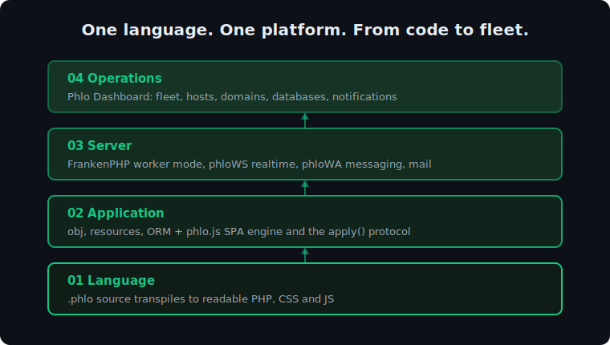
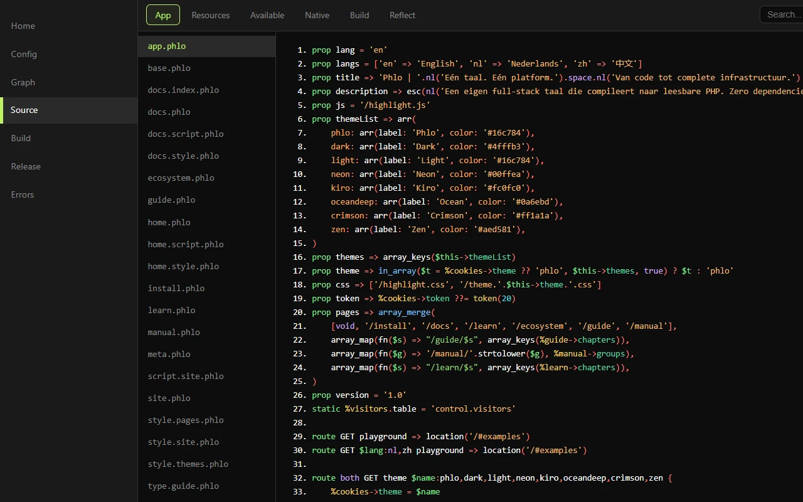

# Phlo

A compile-to-PHP web framework with its own `.phlo` language, a built-in
SPA runtime, the Phlo Control Center (built-in dev panel), and first-class introspection for AI
agents. Zero runtime dependencies.

```phlo
prop title = 'Hello'

route GET => $this->home

method home => view($this->main, 'Home')

view main:
<h1>$this->title</h1>
<p>{{ date('Y') }}</p>
```

That file compiles to a PHP class, a route, an HTML page, and (with a
`<style>`/`<script>` block) a CSS and JS bundle. One `.phlo` file is one
class; the build writes plain PHP you can read, lint and source-map back to
the line you wrote.

## Why Phlo

Phlo is opinionated on purpose. The bets it makes:

- **Compile, don't interpret.** `.phlo` is transformed to readable PHP at
  build time. Errors at runtime map back to your `.phlo` line, not to
  generated soup.
- **One closed loop.** Source to build to lint to sourcemap to error page to
  Control Center to CLI introspection. Every layer points back at the source.
- **Small and dependency-free.** The engine ships its own CSS transpiler, JS
  minifier and SPA runtime. No vendor tree to audit.
- **Agent-first.** `docs/SKILL.md` is a complete language reference written
  for AI agents, and the `reflect::` CLI exposes routes, views, the parsed
  AST and dependency graphs as JSON. An agent can build, introspect and fix a
  Phlo app without guessing.
- **Convention over configuration.** File name becomes class name. Named
  `phlo_app()` arguments become constants. `data/app.json` stays tiny.

If you want a large ecosystem, a package for everything, and a team-standard
hiring pool, reach for Laravel or Symfony. If you want a small, legible
full-stack engine that one person (or one agent) can hold in their head,
Phlo is for you.

## One platform, four layers



The language is the bottom layer of one continuous system; each layer is
built with the previous one, in the same syntax:

1. **Language**: `.phlo` source compiles to readable PHP, CSS and JS.
2. **Application**: backend resources (ORM, sessions, security, AI) plus the
   phlo.js SPA engine and the `apply()` protocol;
   [Phlo CMS](https://github.com/q-ainl/phlo-cms) adds a schema-driven CRUD
   and admin layer on top.
3. **Server**: production on [FrankenPHP](https://frankenphp.dev) in worker
   mode, realtime through [phloWS](https://github.com/q-ainl/phlo-websocket),
   WhatsApp messaging through phloWA, mail.
4. **Operations**: the
   [Phlo Dashboard](https://github.com/q-ainl/phlo-dashboard) manages apps
   and servers as a fleet: uptime, domains, databases, notifications.

The full story, guide, tutorial and reference live at
[phlo.tech](https://phlo.tech); machine-readable docs at
[phlo.tech/llms.txt](https://phlo.tech/llms.txt).

## Quick start

Requirements: PHP >= 8.3. Optional extensions per resource (`pdo_mysql`,
`sodium`, `gd`).

```bash
git clone https://github.com/q-ainl/phlo.git
php phlo/install.php /path/to/my-app
```

The installer asks for a name, host, purpose and which resources to enable,
writes a buildable skeleton (`app.phlo`, `www/app.php`, `data/app.json`,
`data/app.md`), and runs the build so the app is verified before you start.

Serve it with FrankenPHP, Docker, PHP-FPM or, for a quick look:

```bash
php /path/to/my-app/www/app.php reflect::context   # inspect without a server
php -S 127.0.0.1:8000 /path/to/my-app/www/app.php   # then open the host
```

See [docs/deploy.md](docs/deploy.md) for FrankenPHP (incl. worker mode),
Docker and nginx setups.

## The development loop

With `build: true` set in `www/app.php`, the app rebuilds changed `.phlo`
files on request. Two CLI namespaces drive everything:

```bash
php www/app.php build::run      # compile changed sources, returns changed files
php www/app.php build::lint     # parse-check the generated PHP, [] means clean
php www/app.php reflect::context   # app identity, routes, views, recent errors
php www/app.php reflect::routes    # full route map
```

When `dashboard` is set (dev only), the Phlo Control Center (at `/phlo` by convention) offers home, config,
source, build, release and error views.



## Documentation

- **[docs/SKILL.md](docs/SKILL.md)** the full language and build reference
  (also the agent skill).
- **[docs/design.md](docs/design.md)** the rationale behind Phlo's
  non-obvious design decisions (read before changing the engine).
- **[docs/deploy.md](docs/deploy.md)** deployment options.
- **[docs/apply-protocol.md](docs/apply-protocol.md)** the `apply()` SPA
  protocol.
- **[docs/websocket-contract.md](docs/websocket-contract.md)** optional
  WebSocket support (phloWS).
- **[docs/tasks.md](docs/tasks.md)** cron tasks.
- **[docs/model-opt-in.md](docs/model-opt-in.md)** ORM opt-in features.
- **[CONTRIBUTING.md](CONTRIBUTING.md)** how contributions are judged.

## Editor support

Syntax highlighting under [editor/](editor): a VS Code extension (TextMate
grammar, reusable in Sublime/JetBrains/Zed) and a Notepad++ user-defined
language with a function-list parser.

## License

MIT. See [LICENSE](LICENSE).
